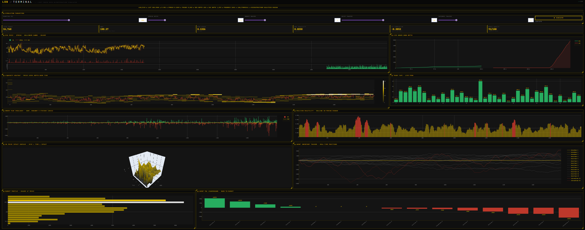

# LOB // TERMINAL
### Limit Order Book Microstructure Simulator



> A full-stack, agent-based market microstructure simulator built from scratch — featuring a price-time priority matching engine, three classes of market participants, real-time analytics, and a live Bloomberg-style terminal dashboard. Simulates 50,000+ trades across 1800 seconds of market time, streaming data live to the UI.

## What is a Limit Order Book?

A limit order book (LOB) is the core data structure of every modern financial exchange — from NASDAQ to Binance. It maintains a real-time record of all outstanding buy (bid) and sell (ask) orders, matching them by price-time priority when they cross. Every trade you've ever seen on a chart was the result of a matching engine exactly like the one in this project.

Understanding the LOB is the foundation of market microstructure — the study of how prices are formed, how liquidity is provided, and how information gets incorporated into asset prices. This project implements that theory from the ground up, not as an abstraction, but as working code.

## Demo


> *1800s simulation — 54,000+ trades, 15 agents, live streaming to dashboard*

## Architecture

```
lob-simulator/
├── lob/
│   ├── order.py          # Order, Side, OrderType, TimeInForce dataclasses
│   ├── book.py           # LimitOrderBook — price-time priority matching engine
│   ├── agents.py         # MarketMaker, NoiseTrader, InformedTrader
│   └── simulation.py     # SimPy discrete-event loop + StreamingBuffer
├── analytics/
│   └── metrics.py        # Spread, OFI, VWAP, price impact, realized volatility
├── dashboard/
│   └── app.py            # Plotly Dash — live Bloomberg terminal UI
├── tests/
│   └── test_book.py      # 16 pytest unit tests for the matching engine
└── requirements.txt
```

**Four layers, built bottom-up:**

**Layer 1 — Engine** (`book.py`): The matching engine. Price-time priority. Limit orders, market orders, IOC, FOK, GTC. Partial fills. Lazy cancellation. O(log n) insertion via `SortedDict`. 16 unit tests covering every edge case.

**Layer 2 — Simulation** (`agents.py`, `simulation.py`): Three agent classes operating on Poisson arrival processes via SimPy. Market makers use inventory-skewed quoting (Avellaneda-Stoikov). Informed traders carry a decaying private signal (Glosten-Milgrom). A thread-safe `StreamingBuffer` streams data to the dashboard in real time.

**Layer 3 — Analytics** (`metrics.py`): Bid-ask spread dynamics, Order Flow Imbalance (Cont-Kukanov-Stoikov 2013), price impact curve with power-law fitting, VWAP, rolling realized volatility, market quality composite score.

**Layer 4 — Dashboard** (`app.py`): Live-streaming Plotly Dash terminal. 10 panels updating every 600ms while the simulation runs. Gold/black Bloomberg aesthetic with corner-bracket panel styling and scanline CSS overlay.

## Run It Locally

```bash
git clone https://github.com/chadvik88/lob-simulator.git
cd lob-simulator
pip install -r requirements.txt
python dashboard/app.py
```

Open `http://127.0.0.1:8050`, set your parameters, and click **▶ EXECUTE**.

## Dashboard Panels

| Panel | What it shows |
|-------|--------------|
| **Mid Price · Spread · Volume** | Price series with Bollinger bands (±2σ), spread time series, per-trade volume bars colored by direction |
| **Live Order Book Depth** | Cumulative bid/ask depth at the touch — updates every snapshot |
| **Liquidity Heatmap** | Price level depth over time — yellow/white = deep, black = thin. Mid price overlaid in red |
| **Trade Tape** | Last 40 trades as green/red bars with price labels |
| **Order Flow Imbalance** | Bid vs ask depth delta per snapshot, with 10-period moving average |
| **Realized Volatility** | Rolling 20-period log-return standard deviation. Red bars = stress regime (>1.5× mean) |
| **3D Price Impact Surface** | Impact × trade size × time — the square root law visualized in three dimensions |
| **Agent Inventory Tracker** | Real-time position of all 15 agents — gold = market makers, grey = noise, red = informed |
| **Market Profile** | Volume-at-price histogram — the POC (point of control) lights up white |
| **Agent PnL Leaderboard** | Mark-to-market PnL for every agent at simulation end |

## Microstructure Theory

This project implements three foundational models from market microstructure literature:

### Glosten-Milgrom (1985)
The baseline model of informed trading. Dealers set bid-ask spreads to break even against informed traders who know the true asset value. In this simulator, `InformedTrader` agents carry a private signal with Gaussian noise that decays at rate `signal_decay` — as the signal fades, they stop trading, consistent with the GM prediction that informed edge is temporary.

### Avellaneda-Stoikov Market Making
`MarketMaker` agents skew their quotes based on current inventory. When long, they lower both bid and ask to encourage selling and reduce inventory risk. The skew is linear in inventory: `quote = mid ± (spread/2) - skew_factor × inventory`. This prevents the market maker from accumulating infinite inventory and blowing up.

### Cont, Kukanov & Stoikov — Order Flow Imbalance (2013)
OFI measures the net pressure at the best quotes: `OFI = Δbid_depth - Δask_depth`. Empirically, OFI is one of the strongest short-term predictors of price movement — the paper shows R² values above 0.9 at sub-second horizons. This simulator computes OFI from snapshot deltas and displays its correlation with mid-price returns.

## Key Results (1800s simulation, default parameters)

| Metric | Value |
|--------|-------|
| Total trades | ~55,000 |
| Mean bid-ask spread | 0.12 |
| Annualized volatility | ~0.03 |
| OFI-return correlation | −0.05 to −0.40 |
| Market quality score | 70–95 / 100 |

Price follows a random walk with realistic spread clustering and volatility regimes. Informed traders move price in their signal direction. Market makers absorb flow and earn the spread minus adverse selection costs. Noise traders lose money on average — consistent with theory.

## Tests

```bash
pytest tests/test_book.py -v
```

16 tests covering: basic limit matching, partial fills, multi-level sweeps, price-time priority, cancellations, IOC partial fills, FOK success/failure, mid price and spread calculation, depth snapshot ordering.

All 16 pass.

## Future Work

- **Scenario presets** — one-click Flash Crash, High Volatility, Thin Market configurations
- **Replay mode** — record a simulation and step through it frame by frame
- **Export to CSV** — download full trade history and price series
- **Multiple instruments** — two correlated assets with cross-market arbitrage agents
- **Optimal execution** — TWAP/VWAP/Implementation Shortfall algorithms trading against the LOB
- **Web deployment** — live demo hosted on Render

## References

1. Glosten, L. R., & Milgrom, P. R. (1985). Bid, ask and transaction prices in a specialist market with heterogeneously informed traders. *Journal of Financial Economics*, 14(1), 71–100.

2. Cont, R., Kukanov, A., & Stoikov, S. (2013). The price impact of order book events. *Journal of Financial Econometrics*, 12(1), 47–88.

3. Avellaneda, M., & Stoikov, S. (2008). High-frequency trading in a limit order book. *Quantitative Finance*, 8(3), 217–224.

4. Gould, M. D., Porter, M. A., Williams, S., McDonald, M., Fenn, D. J., & Howison, S. D. (2013). Limit order books. *Quantitative Finance*, 13(11), 1709–1742.

## Stack

`Python 3.13` · `SimPy` · `sortedcontainers` · `NumPy` · `pandas` · `SciPy` · `Plotly Dash` · `dash-bootstrap-components`

*Built by [@chadvik88](https://github.com/chadvik88) — incoming freshman, built this the summer before college.*
